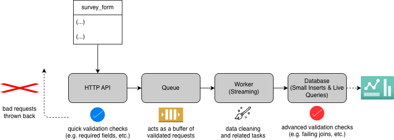

# Design Notes

## 1. Tools & Stack

**dbt (SQL Model) into DuckDB**

Given that the task is to have clear separation between staging models and marts (the fact & aggr. tables), dbt felt like the most fitting choice to me as dbt resolves this layering natively while in pure Python I would have to wire it manually. I also chose DuckDB for the backend because it is the easiest and fastest to get started with locally, benefitting both me as the candidate and you as the reviewer. DuckDB also has a native dbt adapter, simplifying my work [[1]](https://duckdb.org/2025/04/04/dbt-duckdb).

*Fun fact: an old colleague of mine now happens to work at DuckDB (DuckLabs), and I've always wanted to try their product. This seemed like a good opportunity.*

I had not used dbt-like models before in production, however, so I had to do a bit of research on the best approach here. The most important decision I had to make was to choose between Python-model dbt versus SQL-model dbt. I chose SQL because the transformation logic is simple enough and always relational. If I had to do any ML (e.g. sentiment analysis on the `comment_text`), then I would have probably gone with a Python-based model [[2]](https://dataskew.io/blog/sql-vs-python-data-transformations/).

## 2. High-Level Data Flow

I tried to adhere mostly to the structure presented by dbt Labs [[3]](https://docs.getdbt.com/best-practices/how-we-structure/1-guide-overview?version=2.0&name=Fusion()).

Then, the high-level data flow seems natural: raw (data) → staging → marts (fct & aggr.).

- **Raw:** the data as delivered to me in the data folder at root.
- **Staging:** the data from raw but cleaned according to instruction. All the data in here is clean according to business logic. Staging data is also stored as a view rather than a table because this keeps the data fresh for other layers accessing them [[4]](https://towardsdatascience.com/staging-intermediate-mart-models-dbt-2a759ecc1db1/).
- **Marts:** the final fact table ready-for-analysis plus any of the aggregations that depend on this. At first I was worried about circular dependencies, but it looks like it is okay according to convention to have one mart ref another (as long as this is done thoughtfully). I think that only allowing aggregations to access other marts is thoughtful enough [[5]](https://docs.getdbt.com/best-practices/how-we-structure/4-marts?version=2.0). I store marts as tables because they are being accessed by end-users for analysis (as the case instructions said), they should provide the data with less processing time [[4]](https://towardsdatascience.com/staging-intermediate-mart-models-dbt-2a759ecc1db1/).

I am omitting the diagram suggested in the project case because this is a pretty simple data-flow.

## 3. Transformation Logic

Staging will have done all the data cleaning steps required from the project case. This means that only clean records should live in staging. The transformation logic for this cleaning remains relatively simple. Most of it is done in the respective `.sql` files.  For example:

```sql
    SELECT
        submission_id,
        {{ clean_email('user_email') }} AS user_email,
        TRY_CAST(rating AS INTEGER) AS rating,
        TRY_CAST(timestamp AS TIMESTAMP) AS submitted_at,
        comment_text,
        region
    FROM deduped
```

Some cleaning-steps must remain consistent across multiple data-sources since I later join on them (in this case, `user_email`). It is therefore of high importance that the cleaning of this column remains consistent. That is why I make a macro out of it which can later be re-used in the `.sql` files. This also aids with maintainability: if I ever update this cleaning step, I only have to update the macro and it will be changed everywhere it is used accordingly.

```sql

    LOWER(TRIM({{ column_name }}))

```

With cleaned staging data, the join for the fact table becomes straightforward. I left-join on the already distinct `user_email` to avoid missing records in case user metadata is missing (as would happen with an inner-join). I also add a little `rating_bucket` case.

Aggregations reference the joined fact table and are just simple SQL aggregation queries.

## 4. Data Quality & Validation

I implement the tests as described in the project case in `_sources.yml`, where I raise warnings and store faults if, for example, `rating` contains an invalid value. These are the generic checks (as they seem to be called in dbt). Some checks, e.g. timestamp validation, cannot be done as a generic check because the value must first be cast to `TIMESTAMP` before knowing whether it was valid. Hence, it lives as a singular check in `invalid_timestamp.sql`. This means that I am doing the checks on the raw data, not on staging.

Post-join, I also define similar checks which raise warnings and store faults, in `_marts.yml` for missing user data (empty left-join) in the fact table.

What troubles me about my own approach is that I currently have no tests for staging. The reason for this is that I want to ensure staging is already clean, which is why I do the checks on raw and then clean the data into staging. Having checks on staging for those same cleaning steps feels redundant to me, since each staging table so far is connected to only one source. I would be defining checks for exactly the properties I am already filtering on, which feels redundant. I would reserve such error-checks for marts which rely on multiple staging files, as those are also the ones actually used for direct analysis. But this might be (and feels) wrong, so I would be happy to have your thoughts on it.

## 5. Scalability

Materializing staging as views and marts as tables is already a good starting point for handling 100x volume.

Full loads would not necessarily break at 100x, but would definitely become slower. At higher volumes, full loading may become a real bottleneck. That is when incremental, append-only loading keyed on `submitted_at` (formerly `timestamp`) would help.

Furthermore, DuckDB will likely not scale beyond a single node. I came across some methods for running DuckDB in a distributed fashion using independent instances, but I would not want to use a tool for purposes it was not designed for when better alternatives exist. From my research, it seems that all I would have to change anyway is just the `profiles.yml` configuration to point to a more scalable database backend.

Finally, the fact table does not partition by date, despite having access to `submitted_at`. Time-range filters will therefore do full table scans, which becomes increasingly expensive at scale.

## 6. If I Had More Time

Given I only spent 3.5 hours in total on this project (1 hour research, 2.5 hours building), I could not do everything I wanted to. Here is a quick wishlist:

- Add external alerting on test failures, e.g. through Slack webhooks or Nightwatch-like tools, so bad data does not silently accumulate;
- Expand dbt documentation with proper `.yml` column descriptions;
- Reconsider the decision to skip staging tests, as discussed in section 4;
- Set up scheduling and trigger `dbt run` on either a fixed schedule or on new data arriving (though this only makes sense once incremental loading is in place).

Given my choice of SQL-model dbt, I am also fairly limited in the range of transformation steps available. I would like to make the architecture more flexible by introducing Python models, which would unlock the wide array of data science libraries.

## 7. Bonus Task

I want to get started with the numbers: 1000 survey submissions a minute is around 17 a second. That is a lot, but not massive. Results must be ready for analytics in near real-time (within seconds). That makes latency of utmost importance.

1. Data arrives through an HTTP API rather than as updated `.csv` files;
2. Bad requests are rejected immediately and never processed. What counts as "bad" is a flexible business decision;
3. Because this is a latency problem, cleaning runs on each event as it streams into the worker, rather than in scheduled batches;
4. The cleaning and staging logic lives in the worker (as code, reusing the same rules as the dbt staging models); the database then stores only the final fact table and is built for constant small inserts and live queries.



Alternatively, I could clean inside the database (more like what I have already done in this case). Both approaches do require a database that is built for constant small inserts and live queries. While I came across a few options when researching this bonus task, I am not comfortable enough with any of them to recommend one specifically, so I have left the exact database choice open to interpretation (any should work, as long as it supports small inserts and live queries).

## 8. AI Disclosure

I have chatted with AI to learn more about dbt-DuckDB because this is faster than reading the documentation. Only when I was certain I wanted to move forward with dbt-DuckDB, did I dive into the documentation myself.

Furthermore, I have used AI for a few bugfixes in my `.sql` files and to spellcheck this document.
